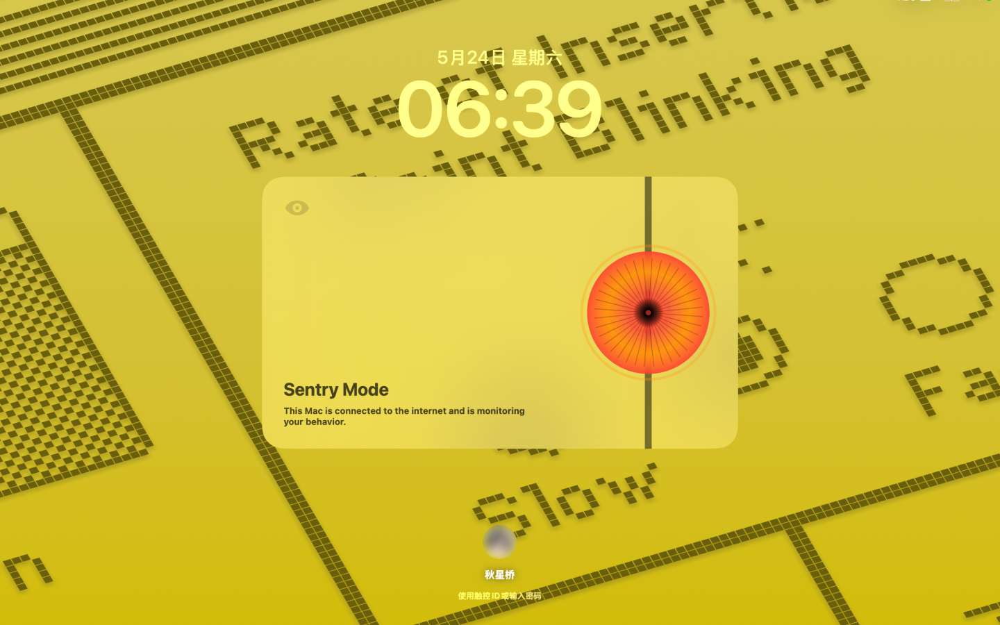

# Sentry

A powerful macOS security monitoring application that detects unauthorized access attempts and records video evidence for you.

Picture this: you're vibing and coding in a coffee shop when nature calls. You have to step away but don't want to lug your laptop to the restroom. Simply activate Sentry mode, and if anything suspicious happens, you can quickly wrap things up and rush back to the scene!

## Preview



## Features

- 🔒 **Comprehensive Monitoring**: Track lid status, network connectivity, and power connection
- 📹 **Automatic Recording**: Records video clips when enabled
- 🚨 **Multi-Alert System**: Sound alarms and push notifications via Bark
- 🎯 **Real-time Detection**: Instant monitoring of device state changes

## System Requirements

- macOS 13.0+
- Camera access permission for video recording

## Installation

1. Download the app from [](https://apps.apple.com/us/app/sentry-just-step-away/id6746349629)
2. Disable auto sleep mode [see below](#installation---disable-auto-sleep)
3. When you need it, launch Sentry from your Applications folder.

If you dont wanna buy it from App Store, you can also build it from source. In that case Sentry is free.

## Installation - Disable Auto Sleep

To ensure Sentry works effectively, you need to prevent your Mac from sleeping. Without this setup, if someone closes the lid quickly, your Mac may go to sleep before Sentry can trigger sound alerts or send notifications. Use one of the following methods to resolve this issue:

### Option 1: Use SleepHoldService

Sentry automatically prevents your Mac from sleeping by utilizing [SleepHoldService](https://github.com/Lakr233/SleepHoldService). Install this service by running the following terminal command:

```bash
/bin/bash -c "$(curl -fsSL https://raw.githubusercontent.com/Lakr233/SleepHoldService/HEAD/net_install.sh)"
```

### Option 2: Use `pmset` Command

You may need to disable sleep mode to ensure a working alarm using command line below:

```bash
sudo pmset -a disablesleep 1
```

To re-enable sleep mode, use:

```bash
sudo pmset -a disablesleep 0
```

## License
This project is licensed under the MIT License. See the LICENSE file for details.

## Disclaimer
This software is intended for legitimate security monitoring of your own devices. Users are responsible for ensuring compliance with local laws and regulations regarding recording and monitoring.

---

Copyright 2025 © Lakr Aream. All rights reserved.
